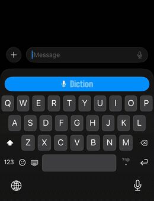
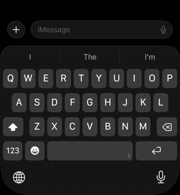
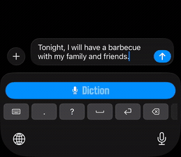

<p align="center">
  <picture>
    <source media="(prefers-color-scheme: dark)" srcset="assets/logo-light.png">
    <source media="(prefers-color-scheme: light)" srcset="assets/logo-dark.png">
    
  </picture>
  <br><br>
  <strong>The iOS keyboard for voice and AI.</strong>
  <br><br>
  Dictate, compose, and edit - by voice, in any app.<br>On-device, cloud, or self-hosted. Open-source gateway.
</p>

<table align="center"><tr>
  <td align="center" valign="bottom">
    <picture>
      <source media="(prefers-color-scheme: dark)" srcset="assets/hero-welcome-dark.gif">
      <source media="(prefers-color-scheme: light)" srcset="assets/hero-welcome-light.gif">
      
    </picture>
  </td>
  <td align="center" valign="bottom">
    <picture>
      <source media="(prefers-color-scheme: dark)" srcset="assets/switch-keyboard-loop-dark.gif">
      <source media="(prefers-color-scheme: light)" srcset="assets/switch-keyboard-loop-light.gif">
      
    </picture>
  </td>
  <td align="center" valign="bottom">
    <picture>
      <source media="(prefers-color-scheme: dark)" srcset="assets/sandbox-edit-loop-dark.gif">
      <source media="(prefers-color-scheme: light)" srcset="assets/sandbox-edit-loop-light.gif">
      
    </picture>
  </td>
</tr></table>

<p align="center">
  <a href="https://apps.apple.com/app/id6759807364"></a>
  <a href="https://www.producthunt.com/products/diction?launch=diction">
    <picture>
      <source media="(prefers-color-scheme: dark)" srcset="https://api.producthunt.com/widgets/embed-image/v1/featured.svg?post_id=1204373&amp;theme=dark">
      <source media="(prefers-color-scheme: light)" srcset="https://api.producthunt.com/widgets/embed-image/v1/featured.svg?post_id=1204373&amp;theme=light">
      
    </picture>
  </a>
</p>

<p align="center">
  <a href="https://diction.one">Website</a> &bull;
  <a href="https://diction.one/self-hosted">Self-Hosting Guide</a> &bull;
  <a href="https://diction.one/privacy">Privacy Policy</a>
</p>

<p align="center">
  <a href="https://github.com/DictionLabs/Diction/blob/main/LICENSE"></a>
  <a href="https://codecov.io/gh/DictionLabs/Diction"></a>
</p>

<p align="center"><sub>A <a href="https://github.com/DictionLabs">Diction Labs</a> project.</sub></p>

<p align="center"><strong>Contributors</strong></p>

<table align="center"><tr>
  <td align="center">
    <a href="https://github.com/omachala">
      <br>
      <sub><b>omachala</b></sub>
    </a>
  </td>
  <td align="center">
    <a href="https://github.com/jeprecated">
      <br>
      <sub><b>jeprecated</b></sub>
    </a>
  </td>
  <td align="center">
    <a href="https://github.com/ankitson">
      <br>
      <sub><b>ankitson</b></sub>
    </a>
  </td>
  <td align="center">
    <a href="https://github.com/DXCanas">
      <br>
      <sub><b>DXCanas</b></sub>
    </a>
  </td>
</tr></table>

---

## What is Diction?

**Diction** is an iOS keyboard that transcribes speech to text directly in any app. Tap the mic, speak, text lands in the field. No switching apps, no copy-paste.

**This repo is the open-source gateway**: a Go service that sits between the iOS keyboard and your speech-to-text backend. It handles the WebSocket streaming protocol, AES-256-GCM end-to-end encryption, and optional LLM cleanup. The iOS app is on the App Store; the gateway is what you self-host.

- **Self-hosted in one command.** `docker compose up` and paste the URL into the app. Your server, your models, your data.
- **Model-agnostic.** The gateway speaks the OpenAI transcription API spec. Point it at any speech-to-text backend that implements it. Your model, your stack.
- **On-device option.** On-device models run locally on the iPhone. No gateway needed for that mode.
- **Encrypted in transit.** AES-256-GCM with X25519 key exchange. Same primitives used by Signal and WireGuard.
- **Zero tracking.** No analytics, no telemetry, no data collection. Audit the source yourself.
- **Free and unlimited.** Self-hosted and on-device modes have no caps, no rate limits, no expiry.

## Self-Hosting

Diction speaks the OpenAI transcription API (`POST /v1/audio/transcriptions`) directly, so any compatible Whisper server works without the gateway. The gateway adds a WebSocket layer for live streaming — audio is transcribed as you speak, so by the time you tap stop the result is already back. For longer dictations the difference is noticeable; for short phrases it barely matters. The gateway also handles end-to-end encryption and optional LLM cleanup.

> **Full walkthrough with screenshots:** [How to Set Up Diction - the self-hosted speech-to-text alternative to Wispr Flow](https://dev.to/omachala/how-to-set-up-diction-the-self-hosted-speech-to-text-alternative-to-wispr-flow-20km)

**Requirements:**
- An NVIDIA GPU gets you the setup below. No GPU? Skip to [No GPU?](#no-gpu-cpu-only-whisper) for the CPU path.
- Any machine that can run Docker: Linux box, NUC, home server, VPS.
- iPhone running iOS 17.0 or later.

### Step 1 - Write the Compose File

Install the [NVIDIA Container Toolkit](https://docs.nvidia.com/datacenter/cloud-native/container-toolkit/latest/install-guide.html) on the host first. Create a folder for the stack and save this as `docker-compose.yml`:

```yaml
services:
  parakeet:
    image: dictionlabs/parakeet:latest-int8
    container_name: diction-parakeet
    restart: unless-stopped
    deploy:
      resources:
        reservations:
          devices:
            - driver: nvidia
              count: 1
              capabilities: [gpu]
    healthcheck:
      test: ["CMD", "bash", "-c", "echo > /dev/tcp/localhost/5092"]
      interval: 30s
      timeout: 5s
      retries: 3
      start_period: 30s

  gateway:
    image: dictionlabs/gateway:latest
    platform: linux/amd64
    container_name: diction-gateway
    restart: unless-stopped
    ports:
      - "8080:8080"
    depends_on:
      - parakeet
    environment:
      DEFAULT_MODEL: parakeet-v3
```

> **Existing installs on `ghcr.io/omachala/diction-gateway` continue to work and receive identical images — no action needed.** Images are now published under [Diction Labs](https://github.com/DictionLabs) on both GHCR and Docker Hub.

Model weights are baked into the `parakeet` image, so there's nothing to download on first start. `DEFAULT_MODEL: parakeet-v3` covers 25 European languages - see [Swap the Speech Model](#swap-the-speech-model) for Whisper models and other languages.

### Step 2 - Start the Stack

```bash
docker compose up -d
```

```bash
docker compose logs -f          # watch progress
docker compose ps               # check status
```

Expected:

```
NAME                     STATUS
diction-gateway          Up 30 seconds
diction-parakeet         Up 30 seconds (healthy)
```

| Error | Fix |
|-------|-----|
| `pull access denied` on gateway image | `docker logout` and retry - a stale login to Docker Hub or `ghcr.io` can shadow the anonymous pull |
| `could not select device driver "nvidia"` | NVIDIA Container Toolkit isn't installed, or Docker wasn't restarted after installing it |
| Gateway exits immediately | Parakeet container failed - check its logs |

### Step 3 - Test the Server

Generate a test audio file (macOS):

```bash
say -o test.aiff "Hello from my home server"
```

Or record a voice memo on your phone and AirDrop it over.

```bash
curl -X POST http://localhost:8080/v1/audio/transcriptions \
  -F "file=@test.aiff" \
  -F "model=parakeet-v3"
```

```json
{"text":"Hello from my home server."}
```

```bash
# Check timing headers
curl -sS -D - -o /dev/null \
  -X POST http://localhost:8080/v1/audio/transcriptions \
  -F "file=@test.aiff" -F "model=parakeet-v3" | grep -i diction
```

That returns three headers, verified against a live gateway:

| Header | Meaning |
|--------|---------|
| `X-Diction-Whisper-Ms` | speech model inference latency in milliseconds |
| `X-Diction-Route-Model` | which backend actually served the request |
| `X-Diction-Route-Lang` | detected language, empty when detection didn't run |

`X-Diction-LLM-Ms` is added when AI cleanup runs. `X-Diction-Route-Model` is the quickest way to
confirm a model switch took effect, since an unrecognised model name silently falls back to
`DEFAULT_MODEL`.

| Response | Cause |
|----------|-------|
| Connection refused | Gateway not running - `docker compose ps` |
| 502 Bad Gateway | Parakeet unreachable, still loading, or `DEFAULT_MODEL` names a service that isn't running |
| 400 Bad Request | Unsupported `response_format` (only `json` and `text`) |
| 404 Not Found | URL typo - path must be exactly `/v1/audio/transcriptions` |
| OOM / container crash | Not enough VRAM - Parakeet INT8 needs about 2 GB |

### Step 4 - Find Your Server's IP

**macOS:**
```bash
ipconfig getifaddr en0
# or
ifconfig | grep 'inet ' | grep -v 127.0.0.1
```

**Linux:**
```bash
hostname -I | awk '{print $1}'
```

**Windows:**
```powershell
ipconfig | findstr IPv4
```

Pick the `192.168.x.x` or `10.x.x.x` address. Ignore anything starting with `100.` - that's Tailscale.

Set a DHCP reservation in your router so the IP doesn't change on reboot. Or use [Tailscale](#reach-from-anywhere) for a stable address that follows the machine anywhere.

### Step 5 - Connect the App

Install [Diction](https://apps.apple.com/app/id6759807364) on your iPhone. On first launch:

1. Settings → General → Keyboard → Keyboards → Add New Keyboard → **Diction**
2. Tap Diction in the list → enable **Allow Full Access**
3. Grant microphone access when prompted

Point it at your server:

1. Open Diction → **Preferences** → **Mode** → **Self-Hosted**
2. Enter your endpoint: `http://192.168.1.42:8080` (your IP from Step 4)
3. Tap **Test connection** - you should get a green check within a second

To dictate: open any app, tap a text field, long-press the globe icon (bottom-left of the iOS keyboard), pick **Diction**, tap the mic, speak, release.

### Reach From Anywhere

**Tailscale (recommended)**

[Tailscale](https://tailscale.com/) creates a private WireGuard mesh between your devices. Install it on the server and iPhone, sign in to the same account, and use the `100.x.x.x` Tailscale IP as your Diction endpoint. Works on cellular, café WiFi, anywhere. Free for personal use.

**Cloudflare Tunnel (public URL, no port forwarding)**

Add to your compose file:

```yaml
  cloudflared:
    image: cloudflare/cloudflared:latest
    container_name: diction-cloudflared
    restart: unless-stopped
    command: tunnel --no-autoupdate run
    environment:
      TUNNEL_TOKEN: "${CLOUDFLARE_TUNNEL_TOKEN}"
```

Create a tunnel in the [Cloudflare Zero Trust dashboard](https://one.dash.cloudflare.com/), grab the token, add it to `.env`, route the public hostname to `http://gateway:8080`. Free tier. Note: transcripts pass through Cloudflare's network (HTTPS-encrypted, but a third party is in the path).

**ngrok (quick testing)**

```bash
ngrok http 8080
```

Free tier URLs change on restart - good for a demo, not daily use.

---

## No GPU? (CPU-only Whisper)

No NVIDIA GPU on the box you're using? Run Whisper on CPU instead. Slower than Parakeet, but it runs anywhere Docker does.

```yaml
services:
  # The whisper server runs as uid 1000. A volume left behind by the older root-based
  # images is owned by root, so without this the server cannot write and every model
  # download fails with a permission error. No-op on a fresh install.
  whisper-models-init:
    image: dictionlabs/whisper-server:latest-cpu
    user: root
    volumes:
      - whisper-models:/cache
    entrypoint: ["sh", "-c", "chown -R 1000:1000 /cache"]
    restart: "no"

  whisper-small:
    image: dictionlabs/whisper-server:latest-cpu
    container_name: diction-whisper-small
    restart: unless-stopped
    depends_on:
      whisper-models-init:
        condition: service_completed_successfully
    volumes:
      - whisper-models:/home/ubuntu/.cache/huggingface/hub
    healthcheck:
      test: ["CMD", "curl", "-fsS", "-o", "/dev/null", "http://localhost:8000/health"]
      interval: 30s
      timeout: 5s
      retries: 3
      start_period: 120s

  # The whisper server never downloads a model on demand: it answers "not installed
  # locally" instead of fetching. Without this one-shot pull the stack starts cleanly
  # and then fails every transcription. Idempotent, exits once the model is on disk.
  whisper-small-pull:
    image: dictionlabs/whisper-server:latest-cpu
    depends_on:
      whisper-small:
        condition: service_healthy
    entrypoint: ["curl", "-fsS", "-X", "POST",
                 "http://whisper-small:8000/v1/models/DictionLabs/whisper-small-ct2"]
    restart: "no"

  gateway:
    image: dictionlabs/gateway:latest
    platform: linux/amd64
    container_name: diction-gateway
    restart: unless-stopped
    ports:
      - "8080:8080"
    depends_on:
      - whisper-small
    environment:
      DEFAULT_MODEL: small

volumes:
  whisper-models:
```

The `whisper-models` volume persists the model weights (~500 MB for `small`) so they survive container rebuilds. The first `up` takes a few minutes longer than later ones while `whisper-small-pull` downloads the model - it exits as soon as that finishes, and subsequent starts skip straight past it.

```bash
docker compose up -d
```

| Error | Fix |
|-------|-----|
| `exec format error` on Apple Silicon | Enable Rosetta in Docker Desktop → Settings → General |
| `health: starting` for > 3 minutes | Model still downloading - `docker compose logs -f whisper-small` |
| Gateway exits immediately | Whisper container failed - check its logs |

Test it the same way as [Step 3](#step-3---test-the-server), with `-F "model=small"` instead of `parakeet-v3`. See [Swap the Speech Model](#swap-the-speech-model) below for `medium` and `large-v3-turbo`.

---

## Swap the Speech Model

Pick a compose profile and set `DEFAULT_MODEL` on the gateway to match:

| `DEFAULT_MODEL` | Compose profile | Service name | Weights served | RAM | Notes |
|-----------------|-----------------|--------------|----------------|-----|-------|
| `small` | `small` | `whisper-small` | `DictionLabs/whisper-small-ct2` | ~850 MB | Best for CPU |
| `medium` | `medium` | `whisper-medium` | `DictionLabs/whisper-medium-ct2` | ~2.1 GB | More accurate, slower on CPU |
| `large-v3-turbo` | `large` | `whisper-large-turbo` | `DictionLabs/whisper-large-v3-turbo-ct2` | ~2.3 GB | Highest accuracy; slow on CPU, fast on GPU |
| `parakeet-v3` | `parakeet` | `parakeet` | baked into the image | ~2 GB | 25 European languages; fast on CPU, faster on GPU |

```bash
docker compose --profile small up -d
```

`DEFAULT_MODEL` and the service name must both match the table: the gateway resolves backends by
Docker hostname, so if the named service isn't running every request fails with `502`.

An unrecognised model name is not an error. The gateway falls back to `DEFAULT_MODEL`, so a typo
transcribes successfully with the wrong model rather than telling you. Check the
`X-Diction-Route-Model` response header to see which backend actually served a request.

The weights column is informational. You do not set it anywhere: the gateway names the model when
it forwards each request. The whisper server does **not** fetch models on demand, so the compose
file ships a one-shot pull service per profile that installs the model before first use. Those are our own
CTranslate2 builds of OpenAI's checkpoints, published at
[huggingface.co/DictionLabs](https://huggingface.co/DictionLabs), so the models your server pulls
come from a namespace we control rather than a third party's conversion.

```bash
docker compose up -d   # recreates only the changed container
```

---

## NVIDIA GPU: More Languages (large-v3-turbo)

Already set up Parakeet from [Step 1](#step-1---write-the-compose-file)? That covers 25 European languages. For the other 74, swap in Whisper large-v3-turbo running on GPU instead:

| | Parakeet TDT 0.6B v3 | Whisper Large-v3-turbo |
|---|---|---|
| WER (English) | ~6.3% | 7.4% |
| Latency (GPU) | Sub-second | Under 2s |
| VRAM | ~2 GB | ~2.3 GB |
| Languages | 25 European | 99 |

```yaml
services:
  whisper-large-turbo:
    image: dictionlabs/whisper-server:latest-cuda
    container_name: diction-whisper-large-turbo
    restart: unless-stopped
    volumes:
      - whisper-models:/home/ubuntu/.cache/huggingface/hub
    deploy:
      resources:
        reservations:
          devices:
            - driver: nvidia
              count: 1
              capabilities: [gpu]

  gateway:
    image: dictionlabs/gateway:latest
    platform: linux/amd64
    container_name: diction-gateway
    restart: unless-stopped
    ports:
      - "8080:8080"
    depends_on:
      - whisper-large-turbo
    environment:
      DEFAULT_MODEL: large-v3-turbo

volumes:
  whisper-models:
```

First boot downloads ~1.6 GB of model weights into the volume. Subsequent starts are instant.

---

## Already Have a Voice Server?

Keep it. Use `CUSTOM_BACKEND_URL` to put the Diction Gateway in front of your existing server for WebSocket streaming and end-to-end encryption:

```yaml
services:
  gateway:
    image: dictionlabs/gateway:latest
    platform: linux/amd64
    container_name: diction-gateway
    restart: unless-stopped
    ports:
      - "8080:8080"
    environment:
      CUSTOM_BACKEND_URL: http://your-existing-server:8000
      CUSTOM_BACKEND_MODEL: DictionLabs/whisper-small-ct2
```

| Variable | Description |
|----------|-------------|
| `CUSTOM_BACKEND_AUTH` | Authorization header forwarded to your backend, e.g. `Bearer sk-xxx` |
| `CUSTOM_BACKEND_NEEDS_WAV` | Set to `"true"` if your backend only accepts WAV - the gateway converts with ffmpeg |
| `CUSTOM_BACKEND_CANONICAL_ID` | HuggingFace-style ID advertised via `/v1/models` (default: `CUSTOM_BACKEND_MODEL`, or the literal `custom` if that is unset too) |

---

## AI Cleanup and Voice Editing (BYO LLM)

The gateway passes transcripts through any OpenAI-compatible LLM before returning them. You say "so um basically the meeting went well and uh they agreed to the timeline." The LLM returns "The meeting went well. They agreed to the timeline."

Enable the **AI Companion** toggle in the app. The gateway forwards the transcript to `{LLM_BASE_URL}/chat/completions` with your prompt, then returns the cleaned text. If the LLM fails, the raw transcript is returned -- dictation never breaks.

When LLM is configured, two additional text routes become available (requires `TEXT_ROUTES_OPEN=true`):

- `POST /v1/text/process?intent=edit` -- apply a spoken voice instruction to text
- `POST /v1/text/process?intent=edit-selected` -- apply an instruction to a selected text range
- `POST /v1/text/suggest` -- return 2-3 alternative phrasings (always soft-fails)

These routes enable AI parity with Diction One on self-hosted gateways: voice-edit and suggestions
work the same way, though results depend on the quality of your chosen model. Smaller models (under
7B) often do not follow edit instructions reliably -- 7B or larger is recommended for editing.

See `AGENTS.md` for the full wire format.

| Variable | Required | Description |
|----------|----------|-------------|
| `LLM_BASE_URL` | Yes | OpenAI-compatible endpoint, e.g. `https://api.openai.com/v1` |
| `LLM_MODEL` | Yes | Model identifier, e.g. `gpt-4o-mini` |
| `LLM_API_KEY` | No | Bearer token. Not needed for local Ollama. |
| `LLM_PROMPT` | No | System prompt for transcript cleanup. String or a file path starting with `/` (mount via volume). Defaults to the built-in cleanup prompt when empty. |
| `LLM_PROMPT_EDIT` | No | System prompt for voice-edit intent (`?intent=edit`). Defaults to the built-in edit prompt. |
| `LLM_PROMPT_EDIT_SELECTED` | No | System prompt for edit-selected intent. Defaults to the built-in edit-selected prompt. |
| `LLM_PROMPT_SUGGEST` | No | System prompt for the suggest endpoint. Defaults to the built-in suggest prompt. |
| `LLM_REASONING_EFFORT` | No | OpenAI-compatible reasoning effort such as `none`, `low`, `medium`, or `high`. Omitted by default. |
| `TEXT_ROUTES_OPEN` | No | Set to `true` to open `/v1/text/process` and `/v1/text/suggest` when `AUTH_ENABLED=false`. Default `false` (routes return 403 until explicitly opened). |

Both `LLM_BASE_URL` and `LLM_MODEL` must be set or the feature stays off.

> **Behavior change from earlier releases:** operators who set `LLM_BASE_URL` and `LLM_MODEL` without `LLM_PROMPT` now receive the built-in cleanup prompt automatically. Previously the gateway logged a warning and sent no system instructions. The default prompt is: *"You are a transcript cleanup tool. Fix grammar, punctuation, and remove filler words. Return only the corrected text, nothing else."*

### Option A - Cloud LLM (OpenAI, Groq, etc.)

```bash
echo "OPENAI_API_KEY=sk-your-key-here" > .env
```

```yaml
  gateway:
    environment:
      DEFAULT_MODEL: small
      LLM_BASE_URL: "https://api.openai.com/v1"
      LLM_API_KEY: "${OPENAI_API_KEY}"
      LLM_MODEL: "gpt-4o-mini"
      LLM_PROMPT: "Clean up this voice transcription. Remove filler words (um, uh, like). Fix punctuation and capitalization. Return only the cleaned text, nothing else."
```

Docker Compose reads `${OPENAI_API_KEY}` from `.env` automatically. Works with any OpenAI-compatible provider - Groq, Together, Fireworks, Mistral, OpenRouter - swap `LLM_BASE_URL` and `LLM_MODEL`.

### Option B - Local Ollama (zero cost, fully private)

```yaml
  ollama:
    image: ollama/ollama:latest
    container_name: diction-ollama
    restart: unless-stopped
    volumes:
      - ollama-models:/root/.ollama

  gateway:
    environment:
      DEFAULT_MODEL: small
      LLM_BASE_URL: "http://ollama:11434/v1"
      LLM_MODEL: "gemma2:9b"
      LLM_PROMPT: "Clean up this voice transcription. Remove filler words. Fix punctuation and capitalization. Return only the cleaned text, nothing else."

volumes:
  whisper-models:
  ollama-models:
```

```bash
docker compose up -d
docker exec diction-ollama ollama pull gemma2:9b
```

| Model | Memory | Notes |
|-------|--------|-------|
| `gemma2:9b` | ~6 GB | Best cleanup quality at this size |
| `qwen2.5:7b` | ~5 GB | Strong instruction following |
| `llama3.1:8b` | ~5 GB | Most popular, well-tested |
| `gemma3:4b` | ~3 GB | For tighter machines |

Models under 7B tend to answer questions about the transcript instead of cleaning it up. 7B or larger recommended.

### Testing cleanup

```bash
curl -X POST "http://localhost:8080/v1/audio/transcriptions?enhance=true" \
  -F "file=@test.aiff" \
  -F "model=small"
```

```bash
# Confirm LLM fired - look for X-Diction-LLM-Ms in the output
curl -sS -D - -o /dev/null \
  -X POST "http://localhost:8080/v1/audio/transcriptions?enhance=true" \
  -F "file=@test.aiff" -F "model=small" | grep -i diction
```

### Prompt file

Mount a file and point `LLM_PROMPT` at the path:

```yaml
  gateway:
    volumes:
      - ./cleanup-prompt.txt:/config/prompt.txt:ro
    environment:
      LLM_PROMPT: "/config/prompt.txt"
```

If `LLM_PROMPT` starts with `/`, the gateway reads it as a file. Otherwise it uses the string directly.

---

## NixOS

The repo ships a flake with a hardened systemd module - no Docker needed.

```bash
nix run github:DictionLabs/Diction#diction-gateway
```

Enable as a service:

```nix
{
  inputs.diction.url = "github:DictionLabs/Diction";

  outputs = { nixpkgs, diction, ... }: {
    nixosConfigurations.your-host = nixpkgs.lib.nixosSystem {
      modules = [
        diction.nixosModules.default
        {
          services.diction-gateway = {
            enable = true;
            openFirewall = true;
            # customBackend.url = "http://127.0.0.1:8000";
            # llm.baseUrl = "http://127.0.0.1:11434/v1";
            # llm.model = "gemma2:9b";
            # environmentFile = "/run/secrets/diction-gateway.env";
          };
        }
      ];
    };
  };
}
```

The unit runs under `DynamicUser` with `ProtectSystem=strict`, `NoNewPrivileges`, and a narrow syscall filter. Use `environmentFile` for secrets - they don't end up in the world-readable Nix store. Full option list: [`nix/module.nix`](nix/module.nix).

---

## OpenAI API Compatibility

The gateway implements the OpenAI audio transcription API - any client that works against `api.openai.com/v1/audio/transcriptions` works against a Diction gateway.

```python
from openai import OpenAI

client = OpenAI(
    base_url="http://your-server:8080/v1",
    api_key="anything",  # not checked when AUTH_ENABLED=false
)

with open("audio.wav", "rb") as f:
    result = client.audio.transcriptions.create(
        file=f,
        model="small",            # or "DictionLabs/whisper-small-ct2"
        response_format="text",
    )
print(result)
```

Works with the Node SDK, LangChain, Flowise, n8n, or any tool that expects OpenAI's speech API.

**Supported:**

- `POST /v1/audio/transcriptions` - `file`, `model`, `language`, `prompt`, `response_format=json|text`
- `GET /v1/models` - returns an OpenAI-compatible `data[]` array plus a `providers[]` grouping consumed by the iOS app. HuggingFace IDs (`DictionLabs/whisper-small-ct2`, `nvidia/parakeet-tdt-0.6b-v3`) and short aliases (`small`, `medium`, `large-v3-turbo`, `parakeet-v3`) are both accepted. The older `Systran/*` and `deepdml/*` ids stay accepted as aliases, so existing scripts keep working.
- WebSocket `/v1/audio/stream` - used by the Diction app for low-latency streaming

**Not supported:**

- TTS (`/v1/audio/speech`)
- `response_format=verbose_json|srt|vtt` (no word-level timestamps)
- SSE streaming on REST (use WebSocket `/v1/audio/stream` instead)
- Model download/delete (`POST`/`DELETE /v1/models/{id}`)
- OpenAI Realtime API (`/v1/realtime`)

**Authentication** is off by default (`AUTH_ENABLED=false`). Pass any non-empty string as the API key from the client - the gateway doesn't check it.

> **Do not set `AUTH_ENABLED=true` on a self-hosted deployment.** It does not enable a shared
> secret. The middleware accepts only an Apple App Store JWS validated against the Apple root CA,
> or an HMAC trial token signed with `TRIAL_SECRET`. Both exist for Diction One. Turning it on
> locks you out of your own server. To expose a gateway publicly, put it behind a reverse proxy
> or tunnel that does the auth, or keep it on a VPN.

**Error shape:** errors return `{"error":"<message>"}`, except auth failures, which return `{"error":"unauthorized","reason":"...","message":"..."}`, not OpenAI's nested `{"error":{"message":"...","type":"..."}}`. Most SDKs surface these as `HTTPError` rather than `APIError`.

---

## Privacy

- **On-device**: Everything stays on your phone. No network connection is made.
- **Self-hosted**: Audio goes to your server only. Neither the gateway nor the whisper server persists audio - it's transcribed and discarded.
- **AI cleanup enabled**: The transcript (plain text, no audio) goes to your configured LLM. If you use Ollama locally, nothing leaves your machine.
- **Diction One (cloud)**: Audio is transcribed and immediately discarded. Not stored, not used for training.
- **Zero third-party SDKs** in the app. No analytics, no tracking, no telemetry.
- **Full Access** is required by iOS for any keyboard that makes network requests. Diction has no QWERTY input - the only data that leaves the app is the audio recording, sent to the endpoint you configured.

Read the full [Privacy Policy](https://diction.one/privacy).

---

## Diction One

On-device and self-hosted are completely free with no word limits.

If you don't want to run a server, Diction One gives you a fine-tuned cloud model with advanced audio filtering - without the setup. Audio is sent to the Diction endpoint, transcribed, and immediately discarded. Pricing and trial details are in the app.

---

## Contributing

Contributions are welcome. See [CONTRIBUTING.md](CONTRIBUTING.md).

## License

MIT. See [LICENSE](LICENSE).
